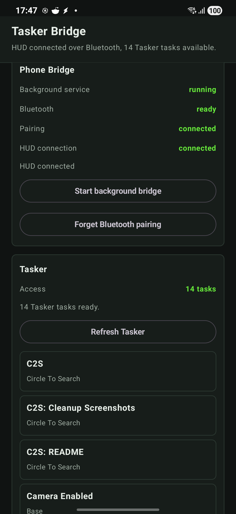
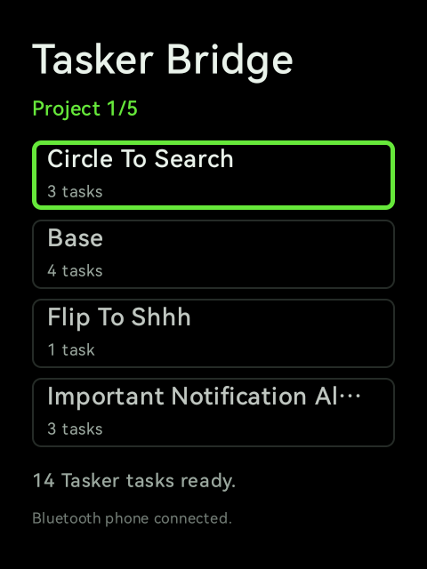

# Tasker Bridge

<p align="center">
  <a href="https://github.com/Anezium/Tasker-Bridge/releases/latest"></a>
  
  
  
  
  
</p>

<p align="center">
  <a href="https://ko-fi.com/M8R61ZTXMI" target="_blank">
    
  </a>
</p>

Tasker Bridge lets you launch your Android Tasker automations from a simple Rokid Glasses HUD. Install the phone APK, start the bridge, then pick and run your tasks directly from the glasses.

<p align="center">
  <a href="assets/screenshots/phone.png"></a>
  &nbsp;&nbsp;&nbsp;&nbsp;
  <a href="assets/screenshots/glasses.png"></a>
</p>

<p align="center">
  <em>Phone bridge and Tasker tasks &middot; Rokid Glasses project HUD</em>
</p>

## Download

Get the latest phone APK from [GitHub Releases](https://github.com/Anezium/Tasker-Bridge/releases/latest).

You only need to install the phone APK manually. The phone build embeds the glasses helper APK and can upload/install/open it on the glasses through CXR-L from the **Glasses HUD** actions. Runtime task commands use Bluetooth, not CXR-L.

See [CHANGELOG.md](CHANGELOG.md) for release notes and upgrade details.

## What It Does

- Lists named Tasker tasks on the Rokid Glasses HUD.
- Launches the selected Tasker task from the glasses.
- Keeps Tasker access and execution on the Android phone.
- Uses Global Hi Rokid CXR-L only to install and launch the glasses helper.
- Uses a lightweight Bluetooth RFCOMM link for HUD task lists and launch commands.
- Pairs by the Tasker Bridge Bluetooth service endpoint, not by the device name.
- Runs a lightweight foreground `connectedDevice` bridge on the phone.
- Refreshes Tasker on HUD open/resume instead of polling forever.
- Responds cache-first, then refreshes Tasker and only pushes an update if the task list changed.

## Requirements

- Rokid Glasses paired with the phone.
- Global Hi Rokid installed on the phone.
- Tasker installed on the phone.
- Tasker external access enabled.
- Tasker run permission granted to Tasker Bridge.
- Wi-Fi enabled on the phone for CXR-L helper upload/install.

Tasker Bridge currently targets Android 31+ on the phone.

## Setup

1. Install the phone APK from the latest release.
2. Open Tasker Bridge on the phone.
3. Accept the Android permissions.
4. Tap **Install HUD** when the helper needs to be installed or updated.
5. Tap **Launch HUD** to open it on the glasses.
6. Keep **Start background bridge** running so the phone can accept HUD commands.
7. On first Bluetooth connection, the phone and HUD remember each other.
8. On the glasses, swipe to choose a task and tap to launch it.

## Controls

```text
Swipe forward: next task
Swipe back: previous task
Tap / OK: launch selected task
Back: hide the HUD
```

The HUD also supports DPAD key events for ADB testing.

## How It Works

```text
Phone app
  -> Global Hi Rokid authorization
  -> CXR-L CUSTOMAPP session for com.anezium.taskerbridge.glasses
  -> helper APK check/upload/install
  -> helper activity launch
  -> CXR-L disconnects after setup

Glasses helper
  -> Bluetooth RFCOMM server while HUD is open
  -> sends READY / REQUEST_TASKS
  -> receives TASK_LIST
  -> sends LAUNCH_TASK

Phone app
  -> foreground connectedDevice service connects to the paired HUD over Bluetooth
  -> sends Tasker run broadcast
  -> returns LAUNCH_RESULT
```

The first successful RFCOMM connection to the Tasker Bridge service UUID is remembered as the paired HUD. Device names such as "Rokid" or "Glasses" are never used for routing, because users can rename their glasses freely. After pairing, the phone connects only to the saved Bluetooth address; use **Forget Bluetooth pairing** to learn a different HUD. The glasses helper also remembers the first phone that connects after install and rejects other Bluetooth clients.

Tasker Bridge uses newline-delimited JSON messages over a stable Bluetooth RFCOMM service UUID:

- phone to glasses: `TASK_LIST`, `LAUNCH_RESULT`, status updates
- glasses to phone: `READY`, `REQUEST_TASKS`, `LAUNCH_TASK`, selection changes

## Battery Behavior

The phone bridge is designed to sit idle. It does not hold a wake lock, does not refresh Tasker on a timer, and does not keep a CXR-L custom app session active. The foreground service exists so Android keeps the Bluetooth bridge alive; Tasker refresh happens when the HUD opens/resumes or when the HUD explicitly asks for the task list.

If the phone app is force-stopped from Android settings, the glasses cannot wake it through Bluetooth because the phone-side service no longer exists. Open the phone app again to restart the bridge.

## Build

Use the local isolated Gradle home if the global Kotlin DSL cache is stale:

```powershell
.\gradlew.bat --gradle-user-home .gradle-user --no-daemon :phone-app:assembleDebug
```

For a GitHub release APK:

```powershell
.\gradlew.bat --gradle-user-home .gradle-user --no-daemon :phone-app:assembleRelease
```

If no release signing secrets are configured, the release variant falls back to the Android debug signing config so the APK remains installable for sideloading.

Outputs:

```text
phone-app/build/outputs/apk/debug/phone-app-debug.apk
phone-app/build/outputs/apk/release/phone-app-release.apk
glasses-helper/build/outputs/apk/debug/glasses-helper-debug.apk
glasses-helper/build/outputs/apk/release/glasses-helper-release.apk
```

The phone build automatically embeds the helper as:

```text
tasker-bridge-glasses-debug.apk
```

inside the phone APK assets.

## Project Layout

```text
phone-app/       Android phone companion, Bluetooth bridge, CXR-L setup, Tasker runtime
glasses-helper/ Rokid glasses HUD, Bluetooth RFCOMM server
shared/         JSON protocol and shared task models
assets/         README screenshots and project media
```

## Notes

Tasker Bridge is experimental Rokid tooling. It depends on Android Bluetooth behavior, Global Hi Rokid CXR-L setup behavior, and Tasker's public external-access/run-task integration, so firmware, Hi Rokid, and Tasker updates can affect the bridge.
